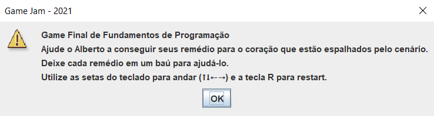
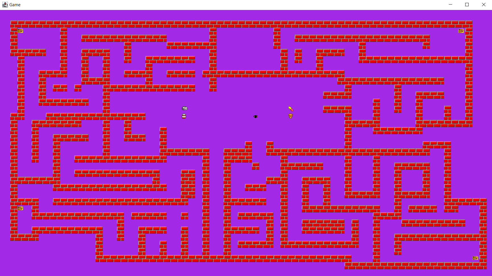

# Game Jam Melies - Materia Fundamentos da Programação
Aluno: Guilherme Lucas dos Santos Costa  
E-mail: tfguilherme.07@gmail.com  
[Linkedin](https://www.linkedin.com/in/guilherme-scosta/)

## Bibliotecas usadas
* Java 11
* Java Swing

## Tema
The Sound of a Heartbeat

## História
Alberto está passando mal do coração e precisa guardar alguns remédio para sobreviver.

## Jogo
### Gameplay
Puzzle - Estilo empurra caixa.

### Telas do jogo
Tela de Start  

Tela do Game  

